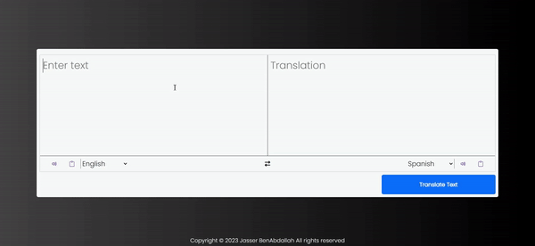

# Text-translation 

# Demo Project
### https://jasserba.github.io/text-translation/

#### Click to see full GIF

# QR Code Generator Readme

This is a simple project that allows users to translate text from one language to another using the Google Translate API. The project is implemented using HTML, Bootstrap 5 for styling, and JavaScript for handling user interactions.

Getting Started
---------------

To run the project locally, follow these steps:

1.  Clone the repository: `git clone https://github.com/your-username/simple-translation-project.git`
2.  Open the `index.html` file in your web browser.

Usage
-----

1.  Enter the text you want to translate in the "Enter text" textarea.
2.  Select the language you want to translate from in the first dropdown.
3.  Select the language you want to translate to in the second dropdown.
4.  Click the "Translate Text" button to see the translation in the "Translation" textarea.
5.  You can also click the exchange icon to swap the selected languages.
6.  The project also provides text-to-speech functionality. Click the speaker icon in each textarea to hear the text spoken in the selected language.

Demo
----

A live demo of the project can be found [here](https://your-username.github.io/simple-translation-project/).

Dependencies
------------

The project uses the following external libraries and APIs:

-   Bootstrap 5: <https://getbootstrap.com/>
-   Font Awesome 6: <https://fontawesome.com/>
-   Google Translate API: <https://translate.googleapis.com/>

License
-------

This project is licensed under the MIT License. See the [LICENSE](https://chat.openai.com/c/LICENSE) file for details.

Acknowledgments
---------------

Special thanks to the developers of Bootstrap and Font Awesome for their amazing tools.

Author
------

This project was created by [Your Name](https://github.com/your-username). Feel free to contact me if you have any questions or suggestions.

Notes
-----

-   The project uses the Google Translate API to perform the translations. Make sure to check their terms of service and usage limits if you plan to use this project extensively.
-   If you encounter any issues or errors, please open an issue on the project's GitHub repository. Your feedback is valuable for improving the project.